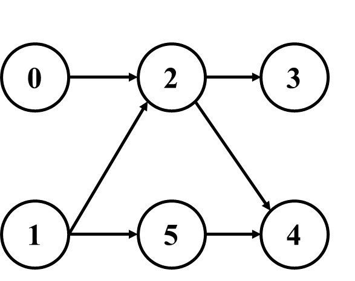

# 12240 - Unique Topological Order

## Description
通常在給定一幅有向無環圖(DAG)的情況下，topological ordering極有可能有複數解，請你找出字典序(lexicographical order)最小的那組topological order。


字典序：

    以字串來舉例字典序(會從頭開始比較字母大小)：ab < abc < abd < acb (因為ab可以視為ab_，底線代表不存在的字元，我們會將它的字典序視為小於其他所有字元，像是數字中的0)

    以數字來舉例字典序(也是從高位數開始比較大小)： 12 < 123 < 124 < 132 (同上，12可視為012，所以在百位數的時候已經確定12是字典序最小的了)

    同樣的道理： topological order [0, 1, 2, ...] < [0, 1, 3, ...] ，由於第三個元素已經可以決定大小，後面的元素已經不影響兩者間的字典序大小了。




Fig 1. 此為sample testcase的第一組DAG。[0, 1, 2, 3, 5, 4] , [1, 0, 5, 2, 4, 3], ...皆為正確的topological order，但以字典序的角度來說[0, 1, 2, 3, 5, 4]是字典序最小的。

## Input
輸入檔的第一行是一個整數 T ，表示有 T 組測資。

每組測資中：第一行有兩個以空白隔開的整數 V 和 E，
表示礦場中有V個node以及E條edge。

接下來的 E 行中每一行都有兩個以空白隔開的整數 ui 和 vi，
表示存在一條由 ui 到 vi 的edge。

1 <= T <= 10
1 <= V <= 1000
0 <= E <= V(V-1)/2
```
2
6 6
1 2
0 2
2 3
2 4
1 5
5 4
6 7
0 1
0 2
1 3
1 4
2 3
2 4
3 5
```

## Output
對於每組測資請輸出字典序最小之topological order，請注意所有整數之間皆由一個空白隔開，在最後一個數字後面並無多餘空白。
```
0 1 2 3 5 4
0 1 2 3 4 5
```
